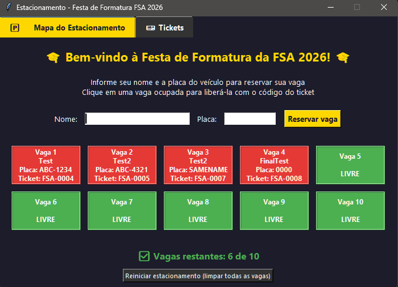

# Parking Management System

Parking management system developed in Python as a learning project.

## About the project

The application simulates the management of a parking lot, allowing users to register vehicles, reserve spaces, generate tickets, and release spaces using the corresponding code.

The system features a graphical interface developed with Tkinter and uses JSON files to store data.

## Features

- Registration of vehicle name and license plate
- Automatic space reservation
- Control of available and occupied spaces
- Automatic ticket generation
- Ticket validation for space release
- Prevention of duplicate license plates
- Ticket history
- Data persistence in JSON

## Technologies used

- Python
- Tkinter
- JSON
- Object-Oriented Programming
- File handling
- Programming logic

## How to run

1. Have Python installed on your computer.
2. Download or clone this repository.
3. Run:

python main.py

## Learning
This project was developed with the goal of practicing Python concepts, programming logic, code organization, and graphical interface development.

During development, Artificial Intelligence tools were used to support the learning process and project construction.

## Interface

